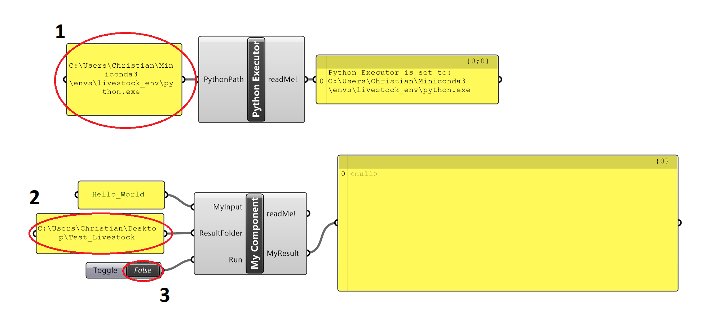

# How to Get Started

## Grasshopper install
Livestock DOES NOT work without a valid installation of Grasshopper and Rhino.

## Anaconda install
We recormend to download and install Anaconda as your Python package manager
[get it here](https://www.anaconda.com/download/)

Follow the instructions on their page.

## Download and install Livestock3d

* Download the Livestock Grasshopper zip [here](https://github.com/livestock3d/livestock_grasshopper/archive/master.zip)
* Create a folder at C:\Users\ocni\AppData\Roaming\McNeel\Rhinoceros\5.0\scripts called livestock3d
* Put the files from the zip in there. Take "My GH Script.gh" and place it on the Desktop.
* Download the Livestock Python zip [here](https://github.com/livestock3d/livestock/archive/master.zip) 
* Create a folder called C:\livestock\livestock3d
* Put the files from the folder called livestock in zip there.

## Run My GH Script.gh
* Open Rhino and Grasshopper
* Open "My GH Script.gh"

1. Set the correct path to the Python Executor
2. Set the correct folder to My Component
3. Run My Component

